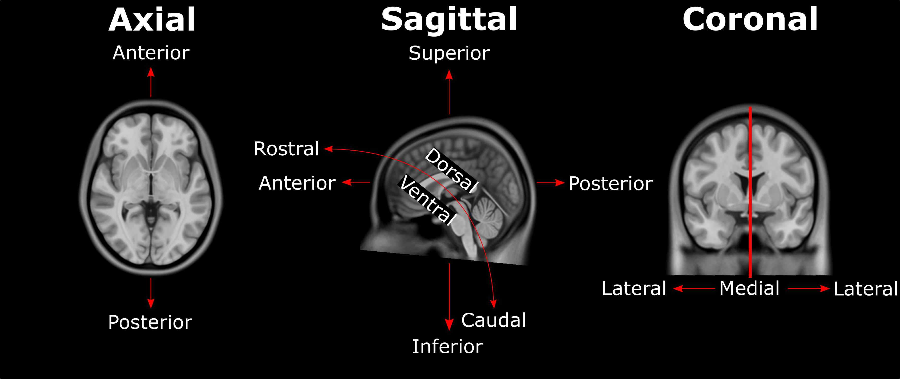

---
title: "AFIDS Protocol"
linkTitle: "AFIDS Protocol"
weight: 4
date: 
description:
no_list: true
---

## Preparation
---

* Download and use <a href="https://download.slicer.org/" target="_blank">3D Slicer 4.10.2</a> (for the time being **DO NOT** use version 4.11 or above)
* Download template files:
 
 

|  species	|       file       |    name   |
|-----------|------------------|-----------|
|human	|<a href="https://drive.google.com/open?id=1v9sNG0D4-I_8ZAfxrej6_pbWlryBSKOF" target="_blank">2009bMNI.nii</a>        |2009bMNI        |
|human	|<a href="https://drive.google.com/open?id=16nZlF9VtgLkANfajbzrJUGHrovgYoS3_" target="_blank">PD25.nii</a>     |PD25     |
|human	|<a href="https://drive.google.com/open?id=1Vvc_dqrFyWXpWsmU7J4nGu6MwwNsWPno" target="_blank">UHF.nii</a> |UHF |
|nhp	|<a href="https://drive.google.com/open?id=1xPdnV58G0Z29bEOtF08feUdor0OSIvIa" target="_blank">D99.nii.gz</a>        |d99        |
|nhp	|<a href="https://drive.google.com/open?id=1CNNX3oGjoP8P8kkPg8Lq2oyFpRlx20L3" target="_blank">inia19.nii.gz</a>     |inia19     |
|nhp	|<a href="https://drive.google.com/open?id=1ps1xoz3eTfzA28mIKPPcDBZ6ZEbZkH9i" target="_blank">macaqueMNI.nii.gz</a> |macaqueMNI |
|nhp	|<a href="https://drive.google.com/open?id=1PMu_8sbMpjk9D6Duf9zt_2FL1NBql1qE" target="_blank">NMTv1.3.nii.gz</a>    |nmtv1.3    |
|nhp	|<a href="https://drive.google.com/open?id=1gqmxoh2k13QTfMXn2wsgsqEXPutyFRQv" target="_blank">yerkes19.nii.gz</a>   |yerkes19   |
|   |   |   |

## Naming Scheme for Fiducial Files
---

* [VolumeID]\_[Contrast]\_[Rater]\_[N] (e.g. macaqueMNI_T1_JL_01)

  * **[VolumeID]** = the identifier for the volume on which you are performing the fiducial placements (use the **name** given to the template in table above)
  * **[Contrast]** = T1 (all templates are T1)
  * **[Rater]** = the unique identifier for the rater performing the fiducial placement; convention will be first initial and last name to prevent overlap
  * **[N]** = reference for fiducial placement session (helpful if performing placements more than once; starting with 1)

## General Fiducial Placement Strategies
---

Use the **"Jump to Slice"** feature to center your view on the fiducial of interest and ensure that the placed landmark appears accurate 
on all three standard views (axial, sagittal, coronal). Once a fiducial is placed, **dragging** the fiducial can allow for more refined 
placement. Holding down **shift** centers the view in all views on the cursor (use along with crosshair function). If a given fiducial 
is classified as **[midline]**, jump to an existing midline fiducial (e.g. AC or PC) and start by placing the fiducial on the 
**sagittal** view and refine placement using the other views. Try to place fiducials at the **boundary/edge** of the feature of 
interest. For some of the fiducials, the instructions for placement will explicitly say to place the landmark using information mostly 
from one view (e.g. axial view for olfactory sulcus). Be aware that changing the windowing of your images (and lighting in the room) may 
affect your perception of where landmarks should be placed. When you're satisfied with the location of a fiducial, **lock it in place** 
to prevent yourself from displacing it later. **NOTE: there is no UNDO feature for fiducial placements.**

## Placement of Fiducial Series
---

Copy points from the **ACPC** markups list to the **Fid32\_[VolumeID]\_[Contrast]\_[Rater]\_[N]** markups list. Copy over AC and PC to your **Fid32** markups list by right clicking each fiducial, choosing "Copy fiducial to another list", and selecting **Fid32\_[VolumeID]\_[Contrast]\_[Rater]\_[N]**. Place the remaining **30 fiducials**, enter the number corresponding to the fiducial in the **Name** textbox and enter the description in the corresponding **Description** textbox. When placing the fiducials make sure you are on the **Fid32\_[VolumeID]\_[Contrast]\_[Rater]\_[N]** markup list.

To help with monitoring the current location of the pointer, toggle on the **Slice intersection** under **Toggle crosshair visibility**.

## Anatomical Direction Guide
---

### Human Anatomy

### NHP Anatomy

